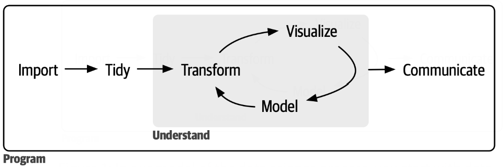



## Outline

- DATA100 Course
- Introduction
- R Basics

# DATA100 Course

## About Me

- Instructor: Agassi Iu

- Education: Closely finishing my PhD in the math department at WLU (previously in BBA/Fin Math DD)

- Experience: Previously taught ST474/674 Monte Carlo Methods in Spring 2025

- Hobbies: Cooking, dancing, soccer, badminton

. . .

::: {.callout-important}
## Office Hours
Wednesdays 14:00–16:00 in LH3073, or by appointment.
:::

## My Teaching Philosophy

::: {.columns}
::: {.column width="48%"}
::: {.callout-note}
## 🧑‍🏫 Teaching Approach
- **Hands-on Learning:** Focus on real datasets, critical inquiry, and practical problem-solving.
- **Active Classroom:** Expect interactive coding sessions and collaborative experimentation.
:::
:::

::: {.column width="48%"}
. . .

::: {.callout-tip}
## 🚪 Open Door Policy
- **First-Year Support:** Transitioning to university can be challenging; support is always available.
- **Open Discussion:** Office hours and discussion forums are safe spaces to clarify concepts.
:::
:::
:::

## What I Hope to Teach

::: {.columns}
::: {.column width="31%"}
::: {.callout-note}
## 🧠 Analytical Mindset
Formulate precise questions, structure complex problems, and analyze data objectively without bias.
:::
:::

::: {.column width="31%"}
. . .

::: {.callout-tip}
## 💻 Technical Fluency
Build confidence with modern open-source tools, repeatable workflows, and clean coding principles.
:::
:::

::: {.column width="31%"}
. . .

::: {.callout-warning}
## 💬 Data Communication
Translate statistical results into compelling visual narratives for technical and business audiences.
:::
:::
:::

## Assessments & Evaluation

| Category | Weight | Frequency |
|---|:---:|---|
| **Laboratories** | 30% | Weekly on Mondays |
| **Participation** | 5% | Every class |
| **Capstone Project** | 15% | Multiple due-dates |
| **Midterm Exams** | 20% | Twice (see syllabus) |
| **Final Exam** | 20% | Final exam period in December |

## Important Tools

::: {.columns}
::: {.column width="31%"}
::: {.callout-note}
## 🐍 Coding Environment
I will teach the course using the software *R*. You will be asked to complete assignments, labs, projects, and even exams in *R*.
:::
:::

::: {.column width="31%"}
. . .

::: {.callout-tip}
## ✉️ Communications
**Please** always check your emails. I will send you emails with updates on the course assessments, should there be any.
:::
:::

::: {.column width="31%"}
. . .

::: {.callout-warning}
## 🌐 Course Hub
Access announcements, submit assignments, and engage in peer discussions via **MyLearningSpace**. I will also update a new course webpage throughout the semester.
:::
:::
:::

## Keys to First-Year Success

::: {.columns}
::: {.column width="48%"}
::: {.callout-note}
## 📅 Start Early
Technical assignments take time to debug. Avoid last-minute coding stress.
:::

. . .

::: {.callout-warning}
## 🏋️ Practice Daily (I hope you do)
Programming is a muscle. Practicing 30 minutes daily is far better than cramming every last-minute.
:::
:::

::: {.column width="48%"}
. . .

::: {.callout-tip}
## ❓ Ask Questions Early
Reach out when stuck for more than 15 minutes. Use office hours liberally.
:::

. . .

::: {.callout-note}
## 👥 Form Study Groups
Connect with classmates to discuss ideas and keep each other accountable.
:::
:::
:::

## My Expectation

::: {.callout-note}
### In-Class
- Be respectful to the instructor and your fellow classmates.
- Bring your laptop or tablet.
  - Only use it for note-taking and participation.
  - <span style="color:red;">If you want to watch a movie, sit at the back.</span>
:::

. . .

::: {.callout-tip}
### Out-of-Class
- Proactive work habits: start early.
- Academic integrity and working independently
- <span style="color:red;">AI usage</span>.
:::

## Artificial Intelligence

::: {.callout-tip}
## University Policy
[**Laurier's Gen AI Policy**](https://www.wlu.ca/about/governance/senior-leadership/vice-president-academic/generative-artificial-intelligence/index.html)
:::

. . .

::: {.callout-note}
## My Policy
- I know what you guys do at home!
- All I am asking for is to spend **15 minutes** diagnosing the problem before going to AI.
- Later on in this course, I will actually ask you to use AI as a mandatory component of your final project.
:::

. . .

::: {.callout-warning}
## My Goal
I hope to give you an enjoyable learning experience, by showing you that this <span style="color:blue;">AI (Agassi Iu)</span> is better at teaching than the <span style="color:red;">AI you use at home</span>.
:::

# Introduction

## Data project work flow



. . .

::: {.callout-note}
## DATA100 Specifically
Data Analysis (for this course at least) mostly concentrates on Preparation and Refinement.
:::

## Data Science

A concept that is still in the making, may take many shapes and forms for different people. Key ideas:

- Look at data from the point of view of a scientist: do experiments, make hypothesis, test hypothesis by more experiments, rinse and repeat, ..., arrive at some conclusion.

- Look at decision making of all kinds from the point of view of data: tell / refute a story with data, make / break a decision by data, persuade / disillusion using data...

## Data Science

Data science is a tool. The correctness of the conclusion *not only* depends on the correctness of the inputs, but also depends on *interpretation*. It is also important that the tool is used responsibly.

- The science: math, statistics, computer programming, etc.
- The output: figures, diagrams, reports, presentation, etc.
- The hope: try to be useful, and hopefully *helpful*. (to whom?)

## Data Analytics

- Data needs statistics
- Data needs programming

# R Basics

## Introduction

- R is a *programming language for statistical computing and graphics*
  - R is software is open source unlike some other statistical software.
  - R can be downloaded at <https://www.r-project.org/>.

- RStudio *is an integrated development environment for R*
  - RStudio will be used in this course.
  - Can be downloaded at <https://posit.co/download/rstudio-desktop/>.
  - Please install R before RStudio, otherwise RStudio will not work.

## User Interface I

- **R Console**
  - Can give R direct instructions via the R console.

- **R script**
  - A text file containing a set of commands and comments.
  - Can create an R script, with the file extension '.R'.
  - Used to run a sequence of commands in R.
  - Other types of scripts such as R markdown files can be created.
  - Good idea to **save** your script or R markdown file periodically.

- **Environment**
  - Where variables are created and stored.
  - Serves as a *Workspace*.

## User Interface II

- **History**
  - Stores the code that has been ran.
  - Next to the Environment tab.

- **Working Directory**
  - R scripts are stored here by default.
  - Can be important when importing data.
  - Permanently change working directory: Tools ⇒ Global Options ⇒ General ⇒ Default working directory
  - Temporarily change working directory: Session ⇒ Set working directory ⇒ Choose Directory
  - The working directory resets to the default when RStudio restarts.

## Base R & R packages

- **Base R**
  - Contains some basic functions and visualization tools.
  - The base R functions contain only a tiny fraction of what is actually available.

- **R packages**
  - A package is essentially a suite of related functions that were created by one or more R users.
  - Currently over 19000 R packages available at <https://cran.r-project.org/>.

- The main packages we will use:
  - *tidyverse*.

## Initializing R packages

- Use `install.packages("package_name")` in the console to install R packages on your own machine.
  - Example: `install.packages("ggplot2")` to install ggplot2.

- Use `library(package_name)` to initialize already installed packages.
  - Example: `library(ggplot2)` to load ggplot2.

- To install the package if it isn't already installed and then initialize it after installation:

```r
if(!require(package_name)) install.packages("package_name")
library(package_name)
```

## Arithmetic Operations

- Order of arithmetic operations (BEDMAS) applies in R.
- Basic operations:

| Operation | Description |
|:---:|---|
| `+` | Addition |
| `-` | Subtraction |
| `*` | Multiplication |
| `/` | Division |
| `^` | Exponent |
| `%%` | Modulus (Remainder from division) |
| `%/%` | Integer Division |

- `#` is used to add comments to R scripts.

## Relational Operators

Relational operators are used to compare between values:

| Operation | Description |
|:---:|---|
| `<` | Less than |
| `>` | Greater than |
| `<=` | Less than or equal to |
| `>=` | Greater than or equal to |
| `==` | Equal to |
| `!=` | Not equal to |

## Assigning Variables

- The operators `=`, `<-`, and `->` can be used to assign values to variables
  - If we want to assign x = 2; `x=2`, `x<-2`, and `2->x` are equivalent.
  - Common convention is to use `<-` but feel free to use `=`.

- Rules for variable names.
  - Start with a letter (`x5` is OK but `5x` is NOT.)
  - Consist of letters, numbers, underscores, and periods (`x_5` and `x.5` are OK but not `x-5`).
  - Case sensitive (`x` and `X` would be different variables).

- Variable naming conventions
  - Try to use meaningful names.

## Displaying Output

- R will display the outputs of unassigned calculations
  - `exp(3)` would compute $e^3$ (approximately) and display the result.

- R suppresses the output of assigned calculations
  - `x<-exp(3)` would compute $e^3$ and store the result in `x` but would not display anything.
  - To see that value of `x` we would need to run `print(x)` or just `x`.

## Workspace (Environment)

- Use `ls()` or `objects()` to generate a list of objects. in workspace.
- Use `rm()` to remove objects from the current workspace.
  - The call `rm(x,y,z)` will remove the variables x, y, and z from the workspace.
  - The call `rm(list=ls())` will remove all objects from the workspace.
  - The workspace is automatically cleared when RStudio is exited.

## Some Useful Functions

| Function | Description |
|---|---|
| `exp(x)` | Computes the exponential function $e^x$. |
| `log(x)` | Computes the logarithmic function $\log_e(x)$. |
| `sqrt(x)` | Computes the square root $\sqrt{x}$. |
| `factorial(x)` | Computes the factorial of a positive integer $x!$. |
| `sin(x)` | Computes the sine of x in radians. |
| `abs(x)` | Computes the absolute value of x. |

## Useful R Resources

- Use `?` to learn more about how a function works.
  - For example, `?sqrt` would produce a brief explanation of the `sqrt` function in a separate window.
  - You can also go to the Help tab and search for the function or command you need help with.

- It may be more useful to use Google
  - <https://stackoverflow.com/>
  - <https://www.r-bloggers.com/>

## Live Coding: Try it Yourself {.smaller}

Edit and run this cell right here in the slide — no local R install needed for anyone in the room.

```{webr}
x <- 6
x^2
x <- 2*x - 1
x + 3
x <- -3*x
y <- -x/2
y
```

## Exercise

What are the final values of `x` and `y` after following this sequence of commands? Predict first, then try it below to confirm.

```{webr}
x <- 6
x^2
x <- 2*x-1
x + 3
x <- -3*x
y <- -x/2
y
```

:::{contenteditable="true" style="border: 0.1px solid black; padding: 8px; font-size: 28px;"}
Notes: 
:::

## Next Time (Next Week)
- We are going to look at a very simple example of:
  - What can we do with data?
  - How do we work with data?
  - Why might this course be useful (at all)?

